# Crypto Arbitrage System - Flowcharts & Diagrams

All diagrams use Mermaid syntax for easy rendering in GitHub, documentation tools, and presentation software.

---

## 1. System Architecture Overview

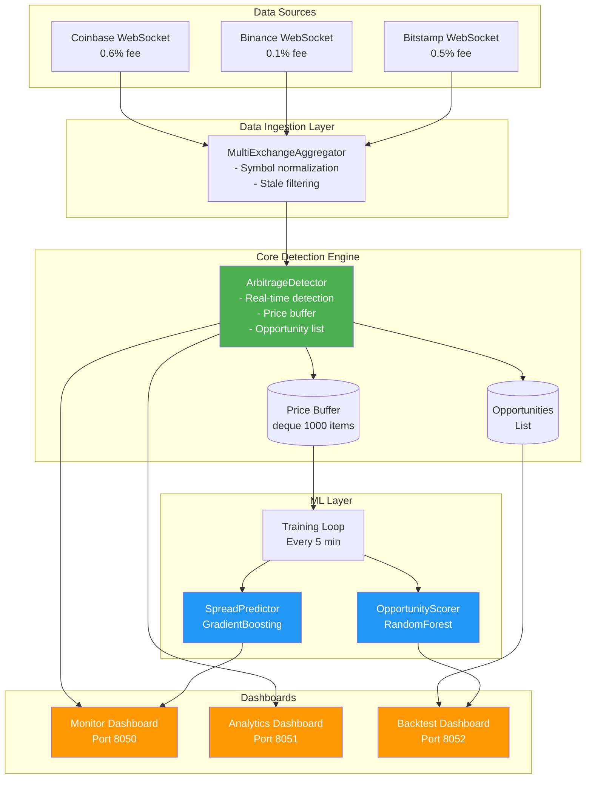

---

## 2. End-to-End Data Flow Pipeline

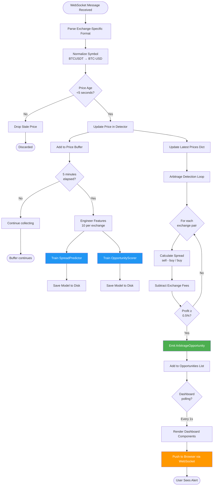

---

## 3. ML Pipeline Detailed Workflow

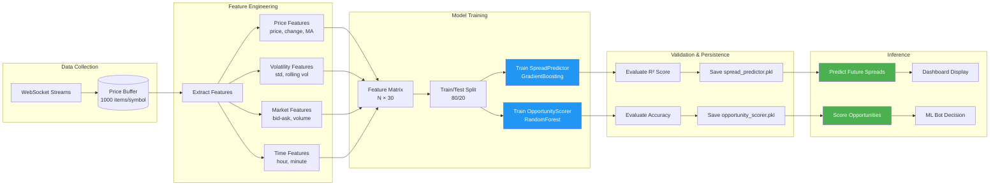

---

## 4. Arbitrage Detection Algorithm

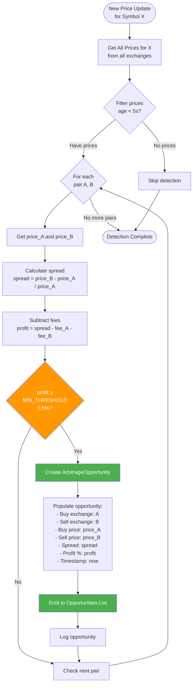

---

## 5. Dashboard Update Cycle

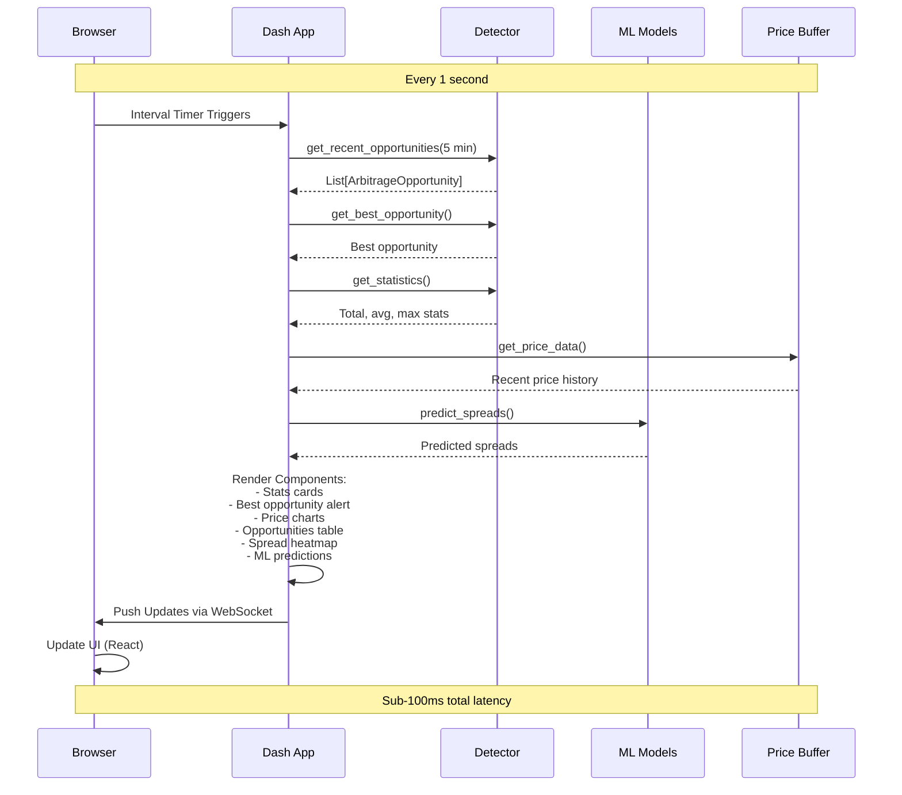

---

## 6. Backtesting Workflow

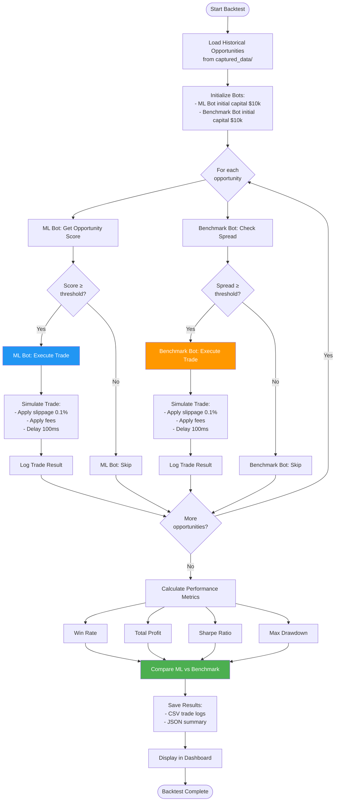

---

## 7. WebSocket Connection Management

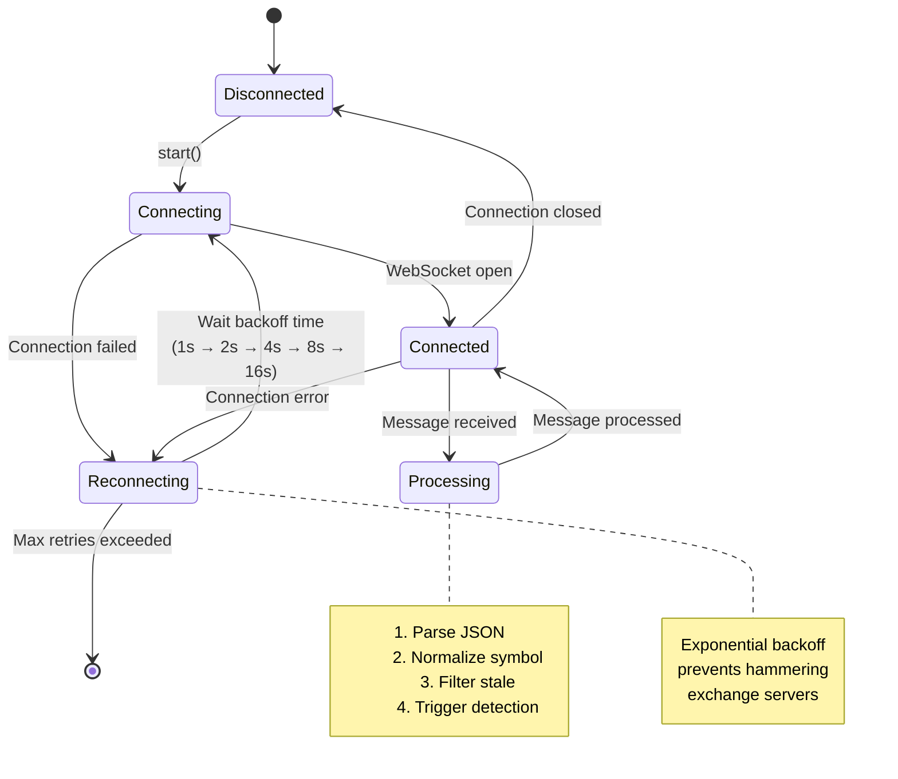

---

## 8. Trading Bot Decision Flow

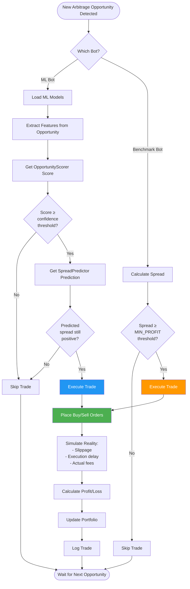

---

## 9. Component Interaction Diagram

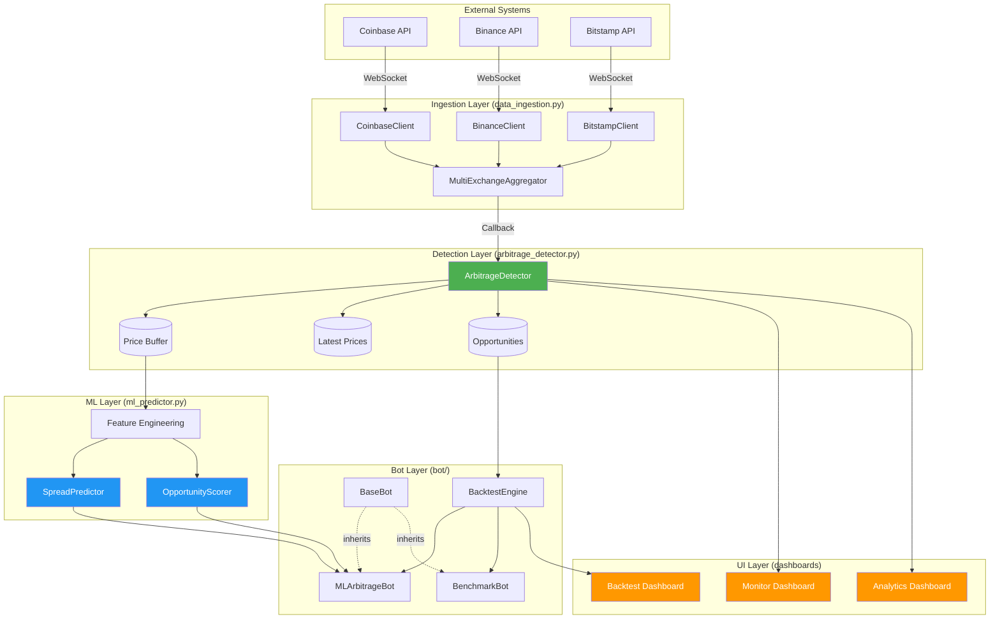

---

## 10. Latency Breakdown Timeline

```mermaid
gantt
    title End-to-End Latency: Price Update → Alert Display
    dateFormat SSS
    axisFormat %Lms

    section Data Reception
    WebSocket receive           :a1, 000, 10ms
    Message parsing             :a2, after a1, 5ms

    section Processing
    Symbol normalization        :b1, after a2, 1ms
    Stale filter check          :b2, after b1, 1ms
    Arbitrage detection         :b3, after b2, 1ms
    Opportunity emission        :b4, after b3, 1ms

    section Dashboard Update
    Dashboard callback trigger  :c1, after b4, 20ms
    Component rendering         :c2, after c1, 30ms
    Browser WebSocket push      :c3, after c2, 15ms

    section Display
    Browser React update        :d1, after c3, 15ms
```

**Total Latency**: ~83ms (Target: <100ms ✅)

---

## 11. Data Model Entity Relationship

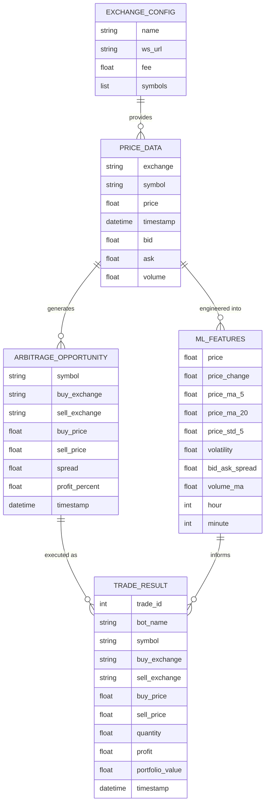

---

## 12. Deployment Architecture (Production)

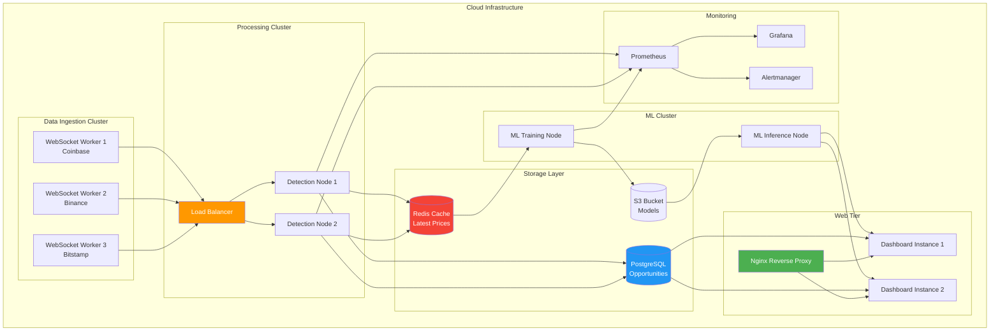

---

## How to Use These Diagrams

### In Presentations
1. Copy Mermaid code blocks
2. Paste into:
   - [Mermaid Live Editor](https://mermaid.live)
   - PowerPoint with Mermaid plugin
   - Google Slides with Mermaid extension
3. Export as SVG/PNG for high-quality images

### In Documentation
- GitHub automatically renders Mermaid in markdown files
- GitLab, Bitbucket also support native Mermaid rendering
- Confluence: Use Mermaid Diagrams macro

### In IDEs
- VS Code: Install "Markdown Preview Mermaid Support" extension
- JetBrains IDEs: Built-in Mermaid support in markdown preview
- Obsidian: Native Mermaid rendering

### For Live Demo
- Use Mermaid Live Editor in browser
- Zoom in/out for emphasis
- Click "Actions" → "Copy SVG" for clean exports
